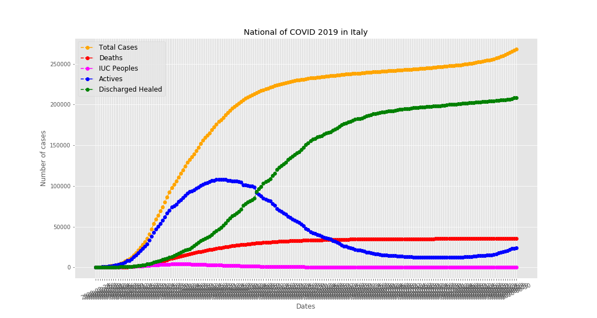
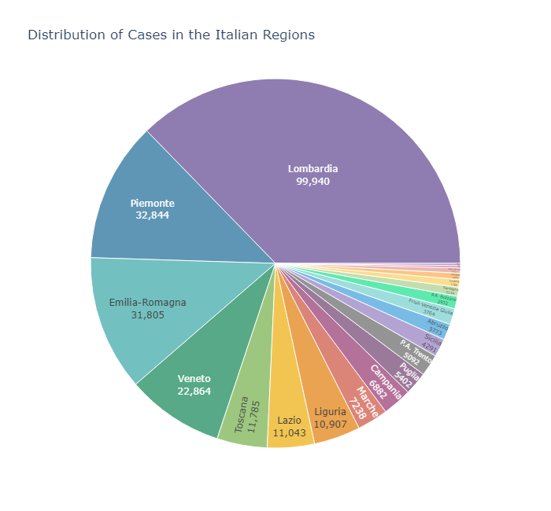
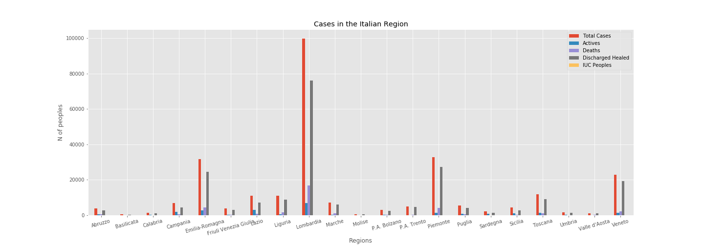
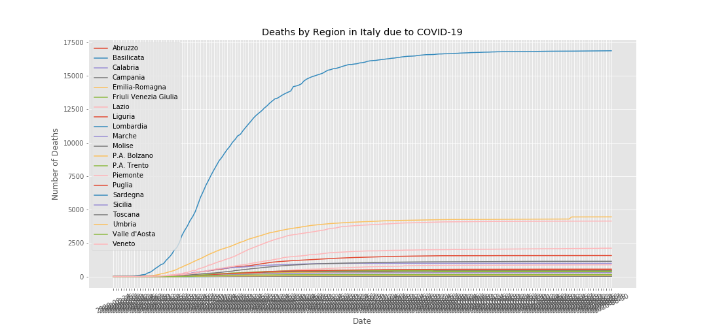

# COVID-19-Italy-Analysis

Coronaviruses are a large family of viruses known to cause diseases ranging from the common cold to more serious diseases such as Middle Eastern Respiratory Syndrome (MERS) and Severe Acute Respiratory Syndrome (SARS).

A Novel Coronavirus (nCoV) is a new strain of coronavirus that has never previously been identified in humans. In particular, the one reported SARS-CoV-2 (previously 2019-nCoV), has never been identified before being reported in Wuhan, China, in December 2019.

## Data

The data used in these analyzes were taken from the official GitHub page of the "Presidenza del Consiglio dei Ministri - Dipartimento della Protezione Civile": https://github.com/pcm-dpc/COVID-19.

## Last Important Graphs

#### Trend of COVID-19 in Italy

#### Cases and Deaths by Date of the Report

#### Distribution of Cases in the Italian Regions

#### Cases in the Italian Region

#### Deaths by Regions in Italy due to COVID-19

## In these analyzes
  1. The national trend with Total Cases, Deaths, IUC Peoples, Actives and Discharged Healed
  2. Charts in logaritmic scale of Total Cases, Deaths and Actives
  3. Cases by Date of the Report
  4. Pie Chart of cases in the Italian Regions
  5. Bar graph with Total Cases, Actives, Deaths, Disharged Hearled and IUC Peoples in the Italian Regions
  6. Time-series of Deaths in the Italian Regions
